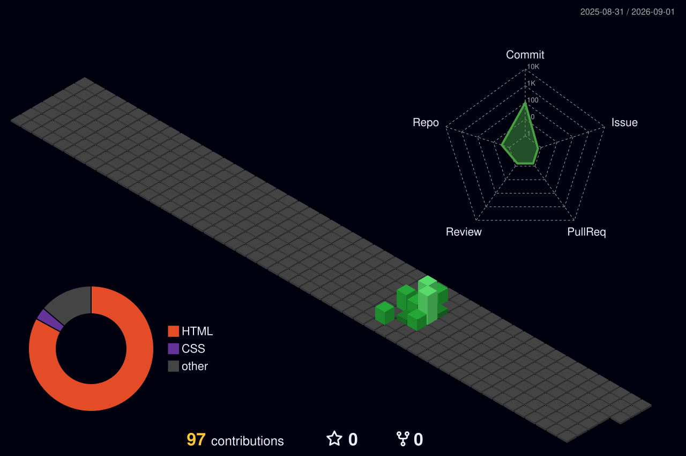

## Hola, soy Victoria
**Estudiante de DAM | En prácticas | Automatización · Web · Mobile**

Estoy empezando a especializarme en **automatización** y desarrollo de **aplicaciones web y móviles**.  
Me gusta construir soluciones claras, mantenibles y orientadas a resultados.

---

## En qué estoy enfocada
- Automatización de procesos y flujos
- Desarrollo web (frontend + backend)
- Desarrollo mobile (en aprendizaje)
- Bases de datos (PostgreSQL)
- Buenas prácticas (estructura, APIs, control de versiones)

## Tecnologías (en progreso)

---

## Algo visual (3D)

  

---

## Oficina Tech (interactiva)

Una mini “oficina” 3D estilo tech (luces neón + pantallas clicables) hecha con Three.js.

- Demo: [vickysape.github.io/vickysape](https://vickysape.github.io/vickysape/)
- Si no te abre, actívalo en GitHub: **Settings → Pages → Deploy from a branch → Branch: `main` / Folder: `/docs`**

---

## Proyectos
- **To-Do App Full Stack** (HTML/CSS/JS + Express + PostgreSQL)
  - API REST: listar, crear, completar tareas
  - Repo: _(añadir enlace)_

---

## Stats

  
  

